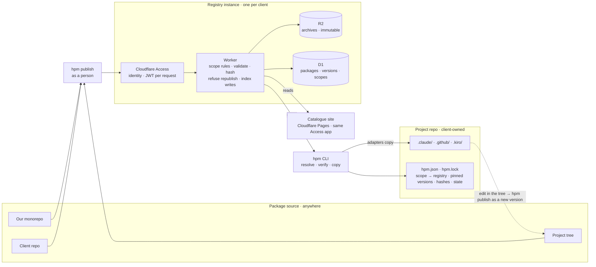
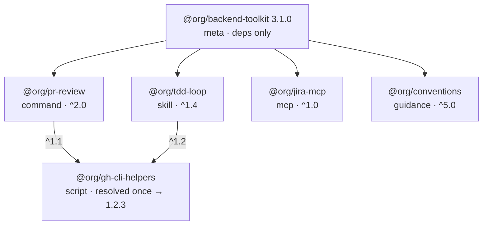

# Harness Package Manager

**Product requirements · working draft v0.7 · 19 Sep 2026**
Owner: Rick Whalley · Audience: platform team, harness authors, engineering leads
CLI name: `hpm` is a placeholder throughout.
Technical design for iteration 1: [superpowers/specs/2026-09-19-iteration-1-technical-design.md](superpowers/specs/2026-09-19-iteration-1-technical-design.md).

Versioned, composable distribution of skills, commands, agents, hooks, scripts and MCP configs across Claude Code, Kiro, GitHub Copilot and Codex, from a registry we deploy per client into repos we do not own.

## Contents

1. [Summary](#1-summary)
2. [Problem and context](#2-problem-and-context)
3. [Ownership model](#3-ownership-model)
4. [Goals and non-goals](#4-goals-and-non-goals)
5. [Users and jobs](#5-users-and-jobs)
6. [Architecture](#6-architecture)
7. [Package model and composability](#7-package-model-and-composability)
8. [Package layout and harness adapters](#8-package-layout-and-harness-adapters)
9. [Registry instance](#9-registry-instance)
10. [Project layout and the tool-owned directory](#10-project-layout-and-the-tool-owned-directory)
11. [Authoring a package](#11-authoring-a-package)
12. [Local customisation and forking](#12-local-customisation-and-forking)
13. [Environment and prerequisites](#13-environment-and-prerequisites)
14. [Versioning rules for prose](#14-versioning-rules-for-prose)
15. [CLI surface](#15-cli-surface)
16. [Manifest and lockfile](#16-manifest-and-lockfile)
17. [Discoverability and the website](#17-discoverability-and-the-website)
18. [Security and governance](#18-security-and-governance)
19. [Success metrics](#19-success-metrics)
20. [Iteration 1 prototype](#20-iteration-1-prototype)
21. [Phasing after iteration 1](#21-phasing-after-iteration-1)
22. [Decision log](#22-decision-log)
23. [Open questions](#23-open-questions)

---

## 1. Summary

We author harness assets, copy them into project repos, and then edit them in place. Nothing records which version a project has, nothing tells us when it drifts, and there is no path from a local improvement back to a shared version. With 7 people on 4 projects this is annoying. With 100 trained engineers and client repos we do not control, it becomes a support problem.

This document proposes a package manager in the npm and Maven tradition, adapted for assets that are mostly Markdown and small scripts, that must land in four harness layouts, and that live in trees owned by clients. The registry, deployed once per client, is the system of record. Git repos are where people work, not where the truth lives. The core ideas are familiar: packages with semver, a registry, a per-project manifest and lockfile, and a resolver. The adaptations make it fit: authors port per harness inside one package, forks are first-class states, existing trees can be adopted, and semver has rules for prose.

| Atomic packages, meta bundles | Vendored files, lockfile truth | One registry per client, on Cloudflare |
|---|---|---|
| Every component is its own package with its own version. Meta packages compose them into toolkits. Engineers install toolkits. Authors publish components. | Assets are copied into the repo where the harness expects them. The lockfile records what came from where, at which version, with which hash. Drift is detected, not prevented. | A Worker behind Cloudflare Access, with R2 for archives. The registry owns distributables. It never owns source. Iteration 1 is this, a CLI, and one adapter. |

## 2. Problem and context

### What happens today

- A skill is written in the central harness repo, then copied into a project's `.claude/skills/` directory.
- Someone improves it in the project. The central copy does not change. Another project copies the stale one.
- A command references a skill by name. The skill is renamed upstream. The command breaks in three repos, silently, because nothing links them.
- A script needs environment variables that only its author knows about. A second team installs it and gets a stack trace.
- Nobody can answer "which projects are running the old PR-review skill?" without grepping every repo.

### Constraints from the environment

- **Four harnesses, growing.** Claude Code, Kiro and GitHub Copilot first, Codex likely, anything with enterprise penetration after that. Each has its own directory layout, its own hook schema, and its own subset of supported asset types. A skill may legitimately differ between harnesses.
- **Scale jump.** 7 authors today, 100 consumers soon. Consumer ceremony must be near zero. Author ceremony can be higher.
- **Legitimate forks.** Projects do fork skills. Reference files reduce the need but do not remove it. The tool must distinguish a deliberate fork from accidental drift.
- **Client-owned repos.** Clients own their project repos and, when they author skills, the repos those skills are written in. We own a registry and the distributables in it. Nothing more.
- **Fast prototype.** Iteration 1 has to exist quickly. The stack is Cloudflare Workers, R2 and Access because that is the shortest path to a deployable registry with real identity on it.
- **Scripts need secrets.** Many scripts require an env file. Packages must declare needs without ever shipping values.

## 3. Ownership model

This is the assumption everything else is built on, so it gets its own section.

> **Decided: We own distributables. We never own the master.**
> The registry holds immutable, versioned archives. That is the only thing we control. The git repo a skill was first written in may be ours, may be the client's, or may not exist as a separate thing at all, because the skill was written straight into a project tree. The tool's contract is: take a distributable, diff it into a tree we do not control, and be able to say later what came from where.

What follows from that:

- **Source is wherever the manifest is.** `hpm publish` takes a package directory from any location. Our monorepo is a convenience for our own packages, not part of the design. The manifest may record a source URL as metadata. The registry does not depend on it.
- **A project tree can be the source.** When a client edits a skill in their repo and that edit is the version worth keeping, the tool packs the installed files back into an archive and publishes it as a new version. This is the reverse of install and it is how a distributable stays the master when no source repo exists.
- **Existing trees are adopted, not replaced.** A client repo usually already has skills in it. `hpm adopt` matches files against known package hashes, writes a lockfile from what it finds, and lists what it could not match. Every engagement starts here.
- **Enforcement is advisory.** We cannot guarantee a CI check in a client's repo. Drift detection is something we run when we are in the tree. Where the client wants the gate, the status command is a one-line CI step they can add.
- **One registry instance per client.** Client A's skills never share storage or an index with client B's. The registry is a deployable unit, and a project can point different scopes at different instances.
- **Upstreaming is publishing.** There is no pull request to open when there is no source repo. The upstream action is publish a new version. Where a source repo exists, opening a pull request against it is a convenience layered on top, later.

## 4. Goals and non-goals

### Goals

1. One command installs a named toolkit into any supported harness in any project, and a second command tells you whether that project is current, behind, or locally modified.
2. Every asset in a project is traceable to a package and version through a committed lockfile, including assets that were in the tree before the tool arrived.
3. Cross-asset links are declared dependencies with version ranges, resolved by the tool.
4. Authors iterate locally against a real project and publish from wherever the files are, including the project tree itself.
5. Forks are explicit, recorded, and can be reconciled with upstream later.
6. A registry instance can be deployed for a new client in under an hour, with identity enforced from the first request.
7. Every package carries a README and enough metadata to render a browsable catalogue.

### Non-goals

- A public marketplace with ratings, payments or third-party publishing.
- A runtime. The tool arranges files and config. The harness executes them.
- Replacing harness-native config files. The tool writes into them through managed regions and never claims to own them outright.
- Translating assets between harnesses. Authors port. The tool copies.
- User-level installs. Personal, machine-wide assets go through each harness's native plugin mechanism. This tool manages project-scoped, committed assets only.
- Owning or mirroring source repos. The registry stores archives and an index, nothing else.

## 5. Users and jobs

**Consumer engineer**

- I join a project and run one command to get the team's toolkit into my harness.
- I switch from Claude Code to Copilot for a task and get the same skills where the author has ported them.
- A status check tells me my project is three versions behind, and one command brings it current.
- I need to tweak a skill for this project without losing the ability to take upstream fixes.

**Package author**

- I develop a skill against a real project, then publish it from the tree with my own identity.
- I declare that my command needs a specific skill at a compatible version.
- I declare env vars and binaries my script needs, and consumers get a clear preflight failure instead of a runtime one.
- I deprecate a package and point people at its replacement.

**Platform team, and client platform teams**

- I deploy a registry for a new client and decide which people may publish to which scope.
- I adopt a client repo that already has hand-copied skills and see what matches and what does not.
- I maintain "recommended toolkit" meta packages per project archetype.
- I give 100 engineers a website to find what exists before they write it again.

## 6. Architecture



The registry instance is the only thing we own. A person publishes from wherever the package directory is, through Access, and the Worker is the only writer to storage. Reads go through the same Worker so scope-level access applies. The dashed path is the author loop when the project tree is the source.

Components and their single job:

- **Contract.** A separate repo holding the OpenAPI 3.1 description of the registry routes, JSON Schemas for the package manifest, project manifest, lockfile and index, a normative archive and hashing spec, and golden test vectors. It is subtreed into the CLI and registry repos at a tagged version. The CLI is Go and the Worker is TypeScript, so the vectors are what proves the two agree on bytes and not just on types.
- **Package directories.** Anywhere with an `hpm.json`. Our monorepo, a client repo, or a project tree.
- **Publisher.** The `hpm publish` command, run by a person or by CI holding a service token. Packs an archive and sends it to the registry with an Access identity.
- **Cloudflare Access.** Sits in front of every registry route. Authenticates the person against the client's identity provider and attaches a signed JWT to the request. Trusts a person, not a device.
- **Worker.** Verifies the JWT, checks the identity against scope rules, validates the manifest and archive, refuses republishing an existing version, computes hashes, writes the archive to R2 and the metadata to D1, serves the index and archives to readers.
- **R2 and D1.** Archives in R2, immutable. Packages, versions, scopes and their members in D1. The index is a query, not a file that can race.
- **CLI.** A single Go binary, distributed through `updates.stackcube.dev` and the StackCube Homebrew tap. Resolves the project manifest against each scope's registry, fetches and verifies archives, copies files through adapters, writes the lockfile, adopts existing trees, packs trees back into archives. Every mutating command builds a complete plan against a read-only snapshot of the tree, checks it for conflicts, and only then writes, with the lockfile last.
- **Adapters.** One per harness. A root mapping, merge rules for a short list of shared files, and ownership tracking.
- **Catalogue site.** A Pages app behind the same Access application, reading the Worker. Later.

## 7. Package model and composability

A package is a directory with a manifest, a README, and zero or more assets. Two kinds exist, and they differ only in what they contain.

- **Atomic package.** One component: a skill, a command, an agent, a hook set, an MCP server config, a script, or a guidance fragment. Versioned on its own. The cohesion rule: a package is the smallest thing that is useful on its own. A script used only by one skill ships inside that skill's package. A script used by three skills is its own package that the three depend on.
- **Meta package.** A manifest with dependencies and a README, no assets of its own. It names a toolkit: "backend service toolkit", "data platform toolkit". Its version bumps when membership or ranges change. Meta packages can depend on other meta packages.



One toolkit, four components, one shared script. The resolver picks a single version of the script that satisfies both ranges. Every installed file maps back to exactly one package in the lockfile. After install with the Claude Code adapter the owned files are `.claude/commands/pr-review.md`, `.claude/skills/tdd-loop/SKILL.md`, a managed entry `jira` in `.mcp.json`, and a managed region in `CLAUDE.md`.

### Resolution rules

> **Decided: One version per package per project.**
> A project holds exactly one version of any package. Harness directories are flat namespaces: there is one `.claude/skills/tdd-loop/`, so two versions cannot coexist anyway. The resolver takes the highest version satisfying every range that requests the package. If no version satisfies all ranges, install fails with the conflicting requesters named. This is the pip and Cargo model, not the npm one.
> *Rejected:* renaming assets per version to allow coexistence. Breaks the stable names that commands and skills use to reference each other.

> **Decided: Installed names drop the scope, with an alias escape hatch.**
> `@org/tdd-loop` installs as `skills/tdd-loop/` and its command is `/tdd-loop`. People type these names in sessions and read them in docs, so the short form has real value. Two packages from different scopes with the same short name collide, and install fails naming both. The project manifest can then set an alias for one of them. Aliasing a package that has dependents in the project is refused, and the error names them, because a command that references the original name would otherwise fail silently in a session. Iteration 1 detects and refuses collisions but does not apply aliases. A non-empty `aliases` field is rejected until iteration 2.
> *Rejected:* scope as a permanent prefix. Never collides, but every engineer pays for it on every command forever.

> **Decided: File ownership is exclusive.**
> The lockfile records which package owns each installed path and each managed entry in a shared file. If two packages would write the same path, install fails before touching disk.

> **Decided: Meta packages use ranges, projects pin.**
> A meta package declares caret ranges so that consumers pick up patch and minor fixes on update. The project lockfile pins exact versions and hashes so that two clones of the project are identical.

> **Decided: Scopes route to registries.**
> The project manifest maps each scope to a registry URL. A client project can take `@ourorg/*` from our instance and `@client/*` from theirs. The lockfile records which registry each package came from. Dependencies resolve within one registry only: a package may not depend on a package in a different registry. A client who wants one of our packages inside their own toolkit publishes a copy into their instance under their scope, with the source recorded in the manifest, which `hpm copy` makes one command in iteration 2. This keeps each instance self-contained, which is what per-client isolation is for, and means a consumer never needs a login to a second instance to resolve a transitive dependency.

**Later: optional groups.** A meta package may eventually declare optional members installable by name, in the style of pip extras. Deferred until a real toolkit needs it.

## 8. Package layout and harness adapters

> **Decided: Authors port per harness. Adapters copy.**
> A package contains one folder per harness it supports, and each folder follows that harness's own conventions. The author writes the Claude Code version, the Copilot version and the Kiro version, and they may differ. The adapter's per-harness knowledge shrinks to a root mapping: `claude/` lands in `.claude/`, `copilot/` in `.github/`, and so on. When a harness moves a directory, one row in a table changes and no package does.
> *Rejected:* a canonical asset form translated per harness, or a shared folder copied to every harness. Both assume the variants are the same file, and they often are not.

```
@org/tdd-loop/
  hpm.json
  README.md
  CHANGELOG.md
  claude/skills/tdd-loop/SKILL.md
  claude/settings.merge.json          ← fragment, merged into .claude/settings.json
  copilot/skills/tdd-loop/SKILL.md
  kiro/steering/tdd-loop.md
  kiro/hooks/tdd-loop.kiro.hook
```

### Support is declared by presence

The index records which harness folders each version ships. A package supports Kiro if it has a `kiro/` folder. "Unsupported on this harness" means "the author has not ported this yet".

> **Decided: Missing harness folder: warn by default, strict flag per project.**
> By default the install continues, prints a warning naming the package and harness, and records the gap in the lockfile so status can show it. A project can set `"unsupported": "fail"` to refuse any install that is not fully ported for every harness it declares.

### What the adapter still owns

| Harness | Package folder | Project root | Merge files |
|---|---|---|---|
| Claude Code | `claude/` | `.claude/` | `.claude/settings.json` hooks, `.mcp.json`, `CLAUDE.md` |
| GitHub Copilot | `copilot/` | `.github/` | `.github/copilot-instructions.md`, `.vscode/mcp.json` |
| Kiro | `kiro/` | `.kiro/` | `.kiro/settings/mcp.json` |
| Codex | `codex/` | `.agents/` | `AGENTS.md`, `.codex/config.toml` |

Root paths and merge-file lists are adapter data, verified against current harness docs before the adapter ships.

> **Decided: Merge files: append with markers for Markdown, additive structural merge for JSON.**
> Merge files are single files the project also edits by hand, so a package supplies a fragment and the adapter merges it. Fragments live inside the harness folder with a reserved suffix and may target only the adapter's known merge files. A package cannot append to an arbitrary path in a client's repo.

```
claude/CLAUDE.append.md        → <project>/CLAUDE.md
claude/settings.merge.json     → .claude/settings.json
claude/mcp.merge.json          → .mcp.json
codex/AGENTS.append.md         → <project>/AGENTS.md
```

- **Markdown.** First install appends a block to the end of the file, wrapped in begin and end comments naming the package and version. Update replaces the block in place. Removal deletes it. Drift is a hash of the block's content. Text outside the markers is never touched, and order is install order, located by the markers rather than recorded anywhere.
- **JSON and TOML.** The adapter parses both files and walks the fragment. Containers are never owned, only leaves. An object or array missing from the target is created and recorded as a created container. An object on both sides is recursed into. A scalar missing from the target is inserted and recorded by JSON Pointer with a hash of its value. An array element is atomic: it is appended and recorded by the hash of its canonical JSON, because indices shift, and an identical element already present is left alone and not owned. A scalar on both sides with the same value is left alone and not owned. A scalar on both sides with different values stops the install and shows both, rather than overwriting. Removal deletes the recorded leaves, then prunes only the containers that package created that are now empty. Update is remove then insert. The lockfile is where the markers live. Leaf ownership is what lets one package append a hook to an array another package created, and lets either be removed cleanly.
- **Edits must preserve the file.** The adapter must not round-trip the target through parse and stringify. That reformats the whole file and strips comments, some targets are JSON with comments, and every install would become a noisy diff in a repo we do not own. Use an edit-preserving library that computes minimal text edits against the original, of the kind VS Code uses for its own settings files.
- **Merge is additive only.** A package can add a hook, an MCP server, or a permission entry. It cannot change or remove anything the project set by hand. Hand edits outside recorded paths and marker blocks survive updates. Hand edits inside them are reported as drift.
- **Prefer no merge where the harness allows it.** Copilot reads individual instruction files from a directory and Kiro reads individual steering files, so guidance for those harnesses is a plain copy. Merging is only for harnesses whose config is a single file.

Example, a Claude hook fragment merging into a project's existing settings:

```jsonc
// fragment: claude/settings.merge.json
{ "hooks": { "PostToolUse": [ { "matcher": "Edit|Write", "hooks": [ { "type": "command", "command": "scripts/format.sh" } ] } ] } }

// target before: project already has a PreToolUse hook and permissions
{ "permissions": { "allow": ["Bash(npm test)"] }, "hooks": { "PreToolUse": [ /* project's own */ ] } }

// target after: PostToolUse array created, one element appended, permissions untouched
// lockfile records for @org/formatter@1.2.0: leaf /hooks/PostToolUse element sha256-…, created container /hooks/PostToolUse
```

> **Decided: Claude Code: write into the tree, keep the layout plugin-compatible.**
> The adapter writes directly into `.claude/`. The `claude/` folder inside a package follows the plugin layout so that anyone who wants to load a package as a personal plugin can.

### Adopt: the reverse mapping

Adapters also run backwards. Given a tree, an adapter lists the files under its root that look like assets, and the CLI hashes them against every version in the configured registries. Exact matches become managed entries in a new lockfile at that version. Near matches, where the path matches a known package but the content does not, are resolved by finding the closest published version by diff size and then asking the engineer. Files that match nothing are listed for the engineer to decide. Pack is the same mapping used to build an archive from the tree.

> **Decided: Near matches find the closest version by diff, then ask.**
> Adopt fetches each published version of the file, diffs, and picks the smallest. It then prompts, one line per near match:
>
> ```
> @ourorg/tdd-loop  .claude/skills/tdd-loop/SKILL.md
>   You've made changes to 1.2.0 (14 lines differ). The latest version is 1.4.2.
>   [k] keep my changes, record as modified at 1.2.0
>   [u] upgrade to 1.4.2 and discard my changes
>   [d] show my diff against 1.2.0
>   [s] skip, leave untracked
> ```
>
> Upgrade discards in iteration 1, and the prompt says so. In iteration 2 a fourth choice appears: upgrade and carry my changes as a patch. Non-interactive runs, with a yes flag or in CI, record every near match as modified at its closest version and print the same lines without prompting. Nothing is discarded without a person choosing it.

## 9. Registry instance

> **Decided: One instance per client, on Cloudflare.**
> A registry instance is a Worker, an R2 bucket, a D1 database, and an Access application, deployed together from one configuration. Each client gets their own. Their archives, index and identity provider never share infrastructure with another client's. Our own registry is just another instance.
> *Superseded:* Google Cloud with App Engine and Cloud Storage, from v0.2. The interface the CLI speaks is the same, so a client who requires a different cloud can be served later by a second backend. Cloudflare is the fastest path to a deployable instance with identity on it, which is what iteration 1 needs.
> *Rejected:* scopes inside one shared registry with access control separating clients. Simpler to run, but one bug in the rules exposes one client's skills to another, and clients will ask where their data lives.

> **Decided: Cloudflare Access is the identity layer. Trust the person, not the device.**
> Every route on the Worker sits behind an Access application. Access authenticates the person against the client's identity provider and attaches a signed JWT to the request. The Worker verifies the JWT against the team's public keys and reads the identity from it. Scope rules in D1 map identities or identity-provider groups to publish rights per scope. Read rights are per instance: anyone Access admits may read every package in that instance. Device posture is not checked.
> The CLI obtains its token the way Cloudflare's own tooling does: a browser login for the hostname, cached locally, refreshed when it expires. CI uses an Access service token, which is a client id and secret pair, and the Worker treats it as a named non-person identity that scope rules can grant publish rights to.
> Access federates to the client's identity provider, whether Entra, Google, Okta or generic SAML and OIDC, so enterprise login works from the first instance. Both sides still sit behind a seam so that Cloudflare can be replaced. The Worker verifies a JWT against a configured issuer, key set, audience and header, and maps claims to a neutral identity. The CLI has an auth provider per registry. Access is the only provider in iteration 1. A direct OIDC issuer is a later drop-in.

> **Decided: The Worker is the only writer.**
> Publishing means calling the Worker with an archive. It checks the identity against the package's scope, validates the manifest against the schema, refuses a version that already exists, refuses an archive with no README, no changelog entry for the version, an unfilled scaffold marker, or a file matching env-file patterns, computes the hash, writes the archive to R2, and inserts the version into D1. The index is a query over D1, so there is no index file to race on.

> **Decided: No git-ref dependencies.**
> A project cannot depend on an unpublished branch or commit. Every installed archive came through the Worker, was validated, and has a hash in the index. Local iteration uses `link`. Cross-project trials publish under the `next` dist-tag.

> **Decided: Pulumi owns infrastructure, wrangler owns code.**
> One Pulumi stack per client creates the R2 bucket, D1 database, DNS record, Access application, policy and CI service token. A deploy script runs the stack, renders the wrangler configuration from its outputs, applies D1 migrations, deploys the Worker, seeds scope members and runs a smoke test.
> *Rejected:* a hand-written script against the Cloudflare API, which re-implements idempotency. A dashboard runbook, which is not reproducible.

### Routes

All routes are prefixed `/v1`, omitted from the table for brevity. Errors share one JSON shape with a stable `code` that the CLI switches on.

| Route | Does | Iteration 1 |
|---|---|---|
| `GET /index` | Every package with versions, dependency ranges, harness folders present, dist-tags, deprecations, archive hashes. Optional `?scope=` filter. | yes |
| `GET /pkg/:scope/:name` | One package's metadata and README for the latest version. | yes |
| `GET /archive/:scope/:name/:version` | The archive from R2. Client verifies the hash from the index before unpacking. | yes |
| `PUT /pkg/:scope/:name/:version` | Publish. Body is the archive. Identity from the Access JWT. Refuses if the version exists. | yes |
| `POST /pkg/:scope/:name/deprecate` | Set a deprecation notice and replacement. | later |
| `PUT /pkg/:scope/:name/tag/:tag` | Point a dist-tag at a version. | later |
| `GET /scopes` · `PUT /scopes/:scope` | Scope membership. Iteration 1 seeds scopes from the deploy config instead. | later |

Versions are immutable. Withdrawal is a deprecation notice with a suggested replacement, never a delete.

## 10. Project layout and the tool-owned directory

> **Decided: A tool-owned `.hpm/` directory holds each installed package's manifest, README and changelog.**
> Assets live only in the harness directories. The registry is the pristine copy. Nothing is duplicated. The three metadata files are what publish-from-tree needs and what adopt has somewhere to write.

A client project with two packages from our registry and one of their own, on Claude Code and Kiro:

```
acme-payments/
├── hpm.json                         ← project manifest, edited by people
├── hpm.lock                         ← written by the tool
├── .hpm/                            ← tool-owned, committed
│   ├── packages/
│   │   ├── @ourorg/
│   │   │   ├── backend-toolkit/
│   │   │   │   ├── hpm.json         ← meta package: deps only
│   │   │   │   ├── README.md
│   │   │   │   └── CHANGELOG.md
│   │   │   └── tdd-loop/
│   │   │       ├── hpm.json         ← name, version 1.4.2, requires, slots
│   │   │       ├── README.md
│   │   │       └── CHANGELOG.md
│   │   └── @acme/
│   │       └── adr-writer/
│   │           ├── hpm.json
│   │           ├── README.md
│   │           └── CHANGELOG.md
│   └── patches/                     ← iteration 2
│       └── @ourorg+tdd-loop.diff
├── CLAUDE.md                        ← project's own, plus a marker block from @ourorg/conventions
├── .mcp.json                        ← project's own, plus entries recorded in the lockfile
├── .claude/
│   ├── settings.json                ← project's own, plus hook entries recorded in the lockfile
│   ├── skills/
│   │   ├── tdd-loop/SKILL.md        ← owned by @ourorg/tdd-loop
│   │   ├── adr-writer/SKILL.md      ← owned by @acme/adr-writer
│   │   └── legacy-deploy/SKILL.md   ← unmatched, listed by adopt, not tracked
│   └── commands/
│       └── pr-review.md             ← owned by @ourorg/pr-review
├── .kiro/
│   └── steering/
│       └── tdd-loop.md              ← owned by @ourorg/tdd-loop
└── src/ …
```

How each command uses it:

- **Install** unpacks the archive, copies harness folders through the adapter, merges fragments, and writes the three metadata files into `.hpm/packages/`. The lockfile records the version, hash, and every owned path.
- **Status** never needs `.hpm/`. It hashes owned paths against the lockfile.
- **Publish from the tree**, for a package the client edited, say `hpm publish @acme/adr-writer --minor`. The tool takes the owned files from the lockfile and maps them back into harness folders, so `.claude/skills/adr-writer/` becomes `claude/skills/adr-writer/`. Fragments are reconstructed from the target files using the recorded paths and marker blocks, so an edit made to the merged hook is what gets published, not a stale copy. The manifest comes from `.hpm/` with the version bumped. The changelog must have an entry for the new version or publish refuses. The archive goes to the scope's registry, and on success the lockfile moves to the new version with fresh hashes and the package returns to managed.
- **Adopt** writes into `.hpm/` for every match it finds by fetching that version's metadata from the registry. For an unmatched skill the client wrote, `hpm new @acme/legacy-deploy --from .claude/skills/legacy-deploy` writes a template manifest and README stub into `.hpm/`, takes ownership in the lockfile, and the next publish makes it a real package. That is the on-ramp for client-authored skills.
- **Patch and diff** in iteration 2 need the pristine version to diff against. That comes from the registry by version and hash, cached in the user's home directory, not from the tree.

Two rules keep it honest. The tool refuses to publish if the manifest in `.hpm/` has been hand-edited in a way that changes the package name or scope, since that would publish one package's files under another's identity. And status reports `.hpm/` entries with no matching lockfile package, or the reverse, as a corrupt state to fix before anything else runs.

The project manifest and lockfile could also live inside `.hpm/` to keep a client's repo root to a single dotfile. They are kept at the root because that is where every other package manager puts them and where a CI check will look.

## 11. Authoring a package

Two authoring contexts, same three files. The difference is only where they sit.

**In a package directory**, which is how our own packages live in the monorepo:

```
packages/tdd-loop/
├── hpm.json                      ← identity, version, deps, requirements
├── README.md                     ← the package page
├── CHANGELOG.md                  ← one section per version
├── claude/
│   ├── skills/tdd-loop/SKILL.md
│   └── settings.merge.json
├── copilot/
│   └── skills/tdd-loop/SKILL.md
└── kiro/
    └── steering/tdd-loop.md
```

**In a project tree**, which is how a client author works. Assets stay where the harness reads them and the three files live under `.hpm/packages/@acme/adr-writer/`. The author edits the same three files, just in that location.

Nobody writes these from a blank page. `hpm new @ourorg/tdd-loop --harness claude` scaffolds all three plus a skill stub, and `hpm new @acme/legacy-deploy --from .claude/skills/legacy-deploy` does the same in a project tree for a skill that already exists. The scaffold leaves placeholders marked `HPM-TODO`, and publish refuses while any remain. The marker is specific because a bare `TODO` is legitimate prose in a skill.

### The manifest

```json
{
  "name": "@ourorg/tdd-loop",
  "version": "1.4.2",
  "description": "Red-green-refactor loop that refuses to write code before a failing test",
  "keywords": ["testing", "tdd"],
  "owners": ["rick@ourorg.example"],
  "dependencies": { "@ourorg/gh-cli-helpers": "^1.2" },
  "slots": [
    { "path": "reference/test-conventions.md", "required": false,
      "description": "Project test layout and naming rules the skill should follow" }
  ],
  "requires": { "bin": ["jq"], "env": [] }
}
```

### The README

The README follows a fixed skeleton so the catalogue renders consistently and a reader always finds the same things in the same order. The scaffold writes the headings. The author fills the prose.

```markdown
# tdd-loop
Red-green-refactor loop that refuses to write code before a failing test.

## What it does
Two or three paragraphs. What the skill changes about a session, when it fires, what it will not do.

## How to use it
How to invoke it, what to say, what a good run looks like.

## Customise
What the `reference/test-conventions.md` slot is for and an example of one.

## Requirements
Needs `jq` on the path. No environment variables.
```

Harness support is not written in the README. It is derived from the folders present and shown on the site.

### The changelog

The changelog follows the Keep a Changelog convention: one section per version with the date, newest first. The registry parses the headings.

```markdown
# Changelog

## [1.4.2] - 2026-09-19
- Trigger: also fires when a test file is opened, not only when one is named
- Fixed: stopped suggesting a test runner the project does not use

## [1.4.1] - 2026-09-02
- Fixed: Kiro steering file referenced the Claude slot path
```

The registry enforces three things on publish:

1. The section for the version being published must exist and be non-empty. This applies to every version, including the first.
2. The version in the manifest must be higher than any published version.
3. If the trigger description in any skill's frontmatter differs from the previous published version, the section must contain a line starting with `Trigger:`. This is how the minor-plus-changelog rule in section 14 becomes a check instead of a convention, and it is what update prints when a project crosses that version.

### The release step

`hpm version minor` bumps the manifest, inserts a dated heading at the top of the changelog, and opens it for editing. Then `hpm publish`. An author who edits the version by hand gets the same checks, just without the help.

## 12. Local customisation and forking

Projects will diverge from upstream. The tool's job is to make each kind of divergence explicit, recorded, and recoverable. Three mechanisms, in the order authors should reach for them.

1. **Overlay slots.** A package declares files the project is expected to supply, such as `reference/conventions.md`. The skill references the slot path. The project provides the file. Updates never touch slots.
2. **Patches.** The project edits a managed file. Running `hpm patch` records the diff against the pristine version. On update the tool reapplies the patch to the new version and stops on conflict with both versions shown.
3. **Eject.** The project takes over the package entirely. The lockfile records it as ejected from a specific upstream version. Updates leave it alone. `hpm rebase` offers a three-way merge back onto a managed state when the project is ready.

With the tree as a possible source, there is a fourth outcome for a modified package: publish it. If the client's edit is the version worth keeping, `hpm publish` from the tree makes it the new upstream and the package returns to managed at the new version.

### Package states in the lockfile

| State | Meaning | On `status` | On `update` |
|---|---|---|---|
| **managed** | Installed files match their recorded hashes. | current or outdated | Replaced with the new version. |
| **modified** | A managed file differs from its hash and no patch is recorded. | drift warning, fails in CI mode | Refused until the change is patched, ejected, reverted, or published. |
| **patched** | A recorded diff is applied on top of the pristine version. | current or outdated, patch listed | New version installed, patch reapplied, conflicts halt. |
| **ejected** | Project owns the files. Upstream origin recorded. | informational only | Skipped. Upstream movement reported. |
| **unmatched** | Found by adopt, matches no known package. | listed, not tracked | Untouched. |

**modified** is the state we have everywhere today, and it is the only one the tool treats as a problem. The others are choices the team made on purpose, and the tool keeps working with them.

## 13. Environment and prerequisites

Packages declare what they need. They never carry values.

- **Env vars.** Each has a name, description, required flag, and secret flag. Install writes or extends a `.env.example`. `hpm doctor` reports missing required vars by package.
- **Binaries and runtimes.** A package can require `jq`, `gh`, `python >= 3.11`. Doctor checks the path and version.
- **Harness version.** A package can require a minimum harness version, the way npm packages declare engines.

```jsonc
// hpm.json, excerpt from a script package
"requires": {
  "env": [
    { "name": "JIRA_BASE_URL", "required": true,  "secret": false, "description": "Cloud instance URL" },
    { "name": "JIRA_TOKEN",    "required": true,  "secret": true,  "description": "API token, read scope" }
  ],
  "bin": ["jq", "gh>=2.40"],
  "harness": { "claude-code": ">=2.0" }
}
```

## 14. Versioning rules for prose

Semver only works if authors agree on what a breaking change is. For a skill, the public surface is its name, the inputs it expects, the slots and env vars it declares, and the files it references. One version covers every harness variant in the package, so a change to only the Kiro folder still bumps the package.

| Change | Bump | Why |
|---|---|---|
| Rename a package, command, skill, or agent | **major** | Every reference by name breaks. |
| Remove or rename an overlay slot or env var | **major** | Projects that supplied the slot or var stop working. |
| Add a required env var or binary | **major** | Installs that worked now fail doctor. |
| Change a script's arguments or output shape | **major** | Callers depend on it. |
| Remove a harness folder | **major** | Projects on that harness lose the asset. |
| Change a skill's trigger description | **minor** + changelog line | Nothing references it, but when the skill fires changes. The changelog entry is mandatory and update output shows it. |
| Add an optional slot, env var, asset, or harness folder | **minor** | Additive. |
| Add or remove a member of a meta package | **minor** add · **major** remove | Removal takes files away from a project. |
| Wording, examples, typo, clarity in instructions | **patch** | Same behaviour intended. |

## 15. CLI surface

| Command | Does | Iteration |
|---|---|---|
| `hpm login <registry>` | Browser login through Access for that hostname. Caches the token. | 1 |
| `hpm init` | Create `hpm.json` in a project, detect installed harnesses, map scopes to registries. | 1 |
| `hpm adopt` | Scan the tree, match files against known package versions by hash, write a lockfile, list near matches and unmatched files. | 1 |
| `hpm new <pkg> [--harness h] [--from path]` | Scaffold manifest, README, changelog and a skill stub, in a package directory or in `.hpm/` for files already in the tree. | 1 |
| `hpm add @org/backend-toolkit` | Add a dependency, resolve, install, write lockfile. | 1 |
| `hpm install` | Install exactly what the lockfile says. Fails if lockfile is missing or stale. | 1 |
| `hpm update [pkg]` | Re-resolve within ranges, install, rewrite lockfile. Prints changelog lines for every version crossed. | 1 |
| `hpm status [--ci]` | Per package: current, outdated, modified, patched, ejected, unmatched, plus harness gaps. CI mode exits non-zero on modified or stale lockfile. | 1 |
| `hpm version <major\|minor\|patch>` | Bump the manifest and insert a dated changelog heading. | 1 |
| `hpm publish [pkg\|dir]` | Pack a package directory, or a package's installed files in the current tree, and send it to its scope's registry as the logged-in person. | 1 |
| `hpm search` · `hpm info` | Query the index, print README. | 1 |
| `hpm outdated` | Installed vs latest satisfying vs latest overall. | 2 |
| `hpm copy @ourorg/tdd-loop --to @acme` | Re-publish a package from one registry into another under a new scope, recording the source. | 2 |
| `hpm doctor` | Check env vars, binaries, harness versions for everything installed. | 2 |
| `hpm patch` · `hpm eject` · `hpm revert` | Move a package between states. | 2 |
| `hpm rebase` | Three-way merge an ejected package back onto a managed upstream version. | 3 |
| `hpm link ../pkgs/tdd-loop` | Install from a local directory for development, marked in the lockfile so it cannot be committed by accident. | 3 |

## 16. Manifest and lockfile

Both files are committed in the client's repo. The manifest is edited by people. The lockfile is edited by the tool. Shapes below are illustrative; the fields are the requirement.

```jsonc
// hpm.json — project manifest
{
  "harnesses": ["claude-code", "kiro"],
  "registries": {
    "@ourorg": "https://hpm.ourorg.example",
    "@acme":   { "url": "https://hpm.acme.example", "auth": "cloudflare-access" }
  },
  "dependencies": {
    "@ourorg/backend-toolkit": "^3.1",
    "@acme/adr-writer": "~0.4"
  },
  "aliases": {},
  "unsupported": "warn"
}
```

A registry entry is a URL, or an object with `url` and `auth`. The URL form means the default auth provider, which is Cloudflare Access.

```jsonc
// hpm.lock — written by the tool
{
  "lockfileVersion": 1,
  "packages": {
    "@ourorg/tdd-loop": {
      "version": "1.4.2",
      "registry": "https://hpm.ourorg.example",
      "integrity": "sha256-9f3a…",
      "requestedBy": ["@ourorg/backend-toolkit@3.1.0"],
      "state": "managed",
      "files": {
        "claude-code": { ".claude/skills/tdd-loop/SKILL.md": "sha256-1c0d…" },
        "kiro": { ".kiro/steering/tdd-loop.md": "sha256-42e7…" }
      }
    },
    "@ourorg/jira-mcp": {
      "version": "1.0.3",
      "registry": "https://hpm.ourorg.example",
      "integrity": "sha256-77be…",
      "state": "managed",
      "managedEntries": {
        ".mcp.json": {
          "leaves": [
            { "ptr": "/mcpServers/jira/command", "value": "sha256-…" },
            { "ptr": "/mcpServers/jira/args", "element": "sha256-…", "indexHint": 0 }
          ],
          "createdContainers": ["/mcpServers/jira", "/mcpServers/jira/args"]
        }
      },
      "missingHarness": ["kiro"]
    },
    "@acme/adr-writer": {
      "version": "0.4.1",
      "registry": "https://hpm.acme.example",
      "integrity": "sha256-b1e0…",
      "state": "managed",
      "adopted": true
    }
  },
  "unmatched": [".claude/skills/legacy-deploy/SKILL.md"]
}
```

## 17. Discoverability and the website

The Worker refuses a publish without a `README.md`, and refuses one whose `CHANGELOG.md` has no entry for the version, including the first. Required manifest metadata: name, version, description, keywords, owners. Optional: a source URL. Harness support is derived from the folders present.

The website is a Pages app deployed alongside each registry instance, behind the same Access application, reading the Worker. Per package it shows: install snippet, versions with dates and changelog entries, dependencies and dependents, which harness folders each version ships, env vars required, deprecation notices. Overall: search, browse by keyword and harness, and recommended toolkits pinned at the top. Iteration 2.

## 18. Security and governance

- **Identity on every request.** Access sits in front of the Worker. No route is reachable without a verified person or service token. The Worker rejects any request whose JWT does not verify against the team's keys.
- **Isolation by instance.** Each client has its own Worker, R2 bucket, D1 database and Access application. There is no cross-client rule to get wrong.
- **Publish rights per scope.** Scope rules map identities or groups to scopes. A person may read everything in an instance they can log in to, and publish only to scopes that list them.
- **Only the Worker writes.** No CLI, CI job or laptop holds R2 or D1 credentials.
- **Provenance is identity plus time.** Every version records who published it and when, from the Access JWT. A source commit is optional metadata the author claims. That is sufficient for iteration 1.
- **Integrity by default.** Every archive hash is in the index and in the lockfile. Install verifies both.
- **Secrets never ship.** The Worker rejects any archive containing a file matching env-file patterns.
- **Scripts are code.** Anything executable in a package is reviewed like production code by whoever owns the scope.
- **Deprecation, not deletion.** Versions are permanent so that lockfiles always resolve.

## 19. Success metrics

| Metric | Target after 90 days of iteration 1 | How measured |
|---|---|---|
| Projects with a committed lockfile | All 4 current, every new project | Scan repos for `hpm.lock` |
| Assets in a client tree matched by adopt | Over 80% on first run | Adopt output on real client repos |
| Packages in "modified" state | 0 in status-checked repos | Status failures trend to zero |
| Time to deploy a registry for a new client | Under 1 hour | Timed on the second client |
| Time for a new engineer to first working install | Under 10 minutes, including login | Onboarding survey |
| Assets living outside any package | 0 in our own repo | Repo audit |

## 20. Iteration 1 prototype

The smallest thing that proves the model end to end on a real client tree. Everything not listed here is deferred, on purpose.

### Contract

- A contract repo with the OpenAPI 3.1 description, JSON Schemas, the archive and hashing spec, and golden vectors, subtreed into the CLI and registry repos.

### Registry

- One Worker with the four iteration 1 routes from section 9: index, package, archive, publish.
- R2 for archives, D1 with three tables: packages, versions, scope members. Scope members seeded from a config file at deploy time.
- An Access application covering the Worker hostname. JWT verification in the Worker. Service tokens accepted and treated as named identities.
- One deploy configuration that stands up all of it for a named client: a Pulumi stack for infrastructure, wrangler for code and migrations. Deploy our own instance first, a client's second.

### CLI

- A Go binary, installed from the StackCube Homebrew tap.
- login, init, adopt, new, add, install, update, status, version, publish, search, info.
- Claude Code adapter only. Copy plus managed regions for `CLAUDE.md`, `.claude/settings.json` and `.mcp.json`.
- Resolver with single-version-per-project and meta packages, as a fixpoint without backtracking. Scope-to-registry routing.
- Lockfile with managed, modified and unmatched states. Patch, eject and rebase come in iteration 2.
- The `.hpm/` directory with per-package manifest, README and changelog.

### Content

- Our existing central repo restructured into package directories with a `claude/` folder each, plus one meta package for the toolkit our 4 projects share.
- Adopt run against all 4 projects. The unmatched list is the first backlog.

### Build order

Eight milestones, each ending in something demonstrable: contract and scaffolding, a walking skeleton from publish to status, deploy with real identity, the package model, the merge engine, tree as source, adopt, then content and rollout. The technical design has the detail.

### Explicitly not in iteration 1

Copilot, Kiro and Codex adapters. Aliases. A second auth provider. The website. Doctor. Patches and eject. Link. Deprecation and dist-tag routes. Optional groups. Telemetry. Signing.

## 21. Phasing after iteration 1

**Iteration 2 · breadth**

- Copilot and Kiro adapters. Warn-or-strict policy for missing harness folders.
- Fork states: patch, eject, revert. Doctor with env and binary checks.
- Catalogue site as a Pages app per instance. Deprecation and dist-tag routes.

**Iteration 3 · author loop**

- Link for local development. Rebase for ejected packages. Codex adapter.
- Scope management routes so a client platform team can administer their own instance.

**Iteration 4 · scale**

- Install telemetry reported to the Worker and adoption views on the site. Archive signing. Optional groups in meta packages. A second backend if a client requires a different cloud.

## 22. Decision log

| Question | Decision | Where |
|---|---|---|
| What we own | Distributables in a registry. Never the source repo. A project tree can be the source. | §3 |
| Registry topology | One instance per client. Scopes in the project manifest route to instances. | §3, §9 |
| Stack for iteration 1 | Cloudflare Worker, R2, D1, Access. Supersedes the Google Cloud decision from v0.2. | §9 |
| Identity | Cloudflare Access in front of every route. Trust the person, not the device. Service tokens for CI. | §9, §18 |
| Who writes to storage | Only the Worker. Anyone with publish rights on a scope may publish from anywhere. | §9 |
| Source repos | Not part of the design. Our monorepo is a convenience for our own packages. Supersedes the monorepo decision from v0.2. | §3 |
| Installed asset names | Drop the scope. Alias in the project manifest on collision. | §7 |
| How packages target harnesses | One folder per harness inside the package. Authors port. Adapters copy. | §8 |
| Package lacks a folder for a declared harness | Warn and record the gap. A per-project strict flag makes it a failure. | §8 |
| Merge files | Append with markers for Markdown. Additive structural merge for JSON and TOML with edit-preserving writes. Fragments target only known merge files. | §8 |
| Tool-owned directory | `.hpm/` holds each installed package's manifest, README and changelog. Assets are never duplicated. | §10 |
| Git-ref dependencies | Not supported. | §9 |
| User-level installs | Out of scope. Native harness plugins cover personal assets. | §4 |
| Trigger description changes | Minor bump with a mandatory changelog line, enforced by the registry when frontmatter changes. | §11, §14 |
| Claude Code adapter and plugins | Write into the project tree. Keep the claude folder plugin-compatible. | §8 |
| Reader access | Through the Worker, behind Access. Read rights are per instance. | §9 |
| Adopt near matches | Closest version by diff size, then prompt the engineer: keep, upgrade and discard, show diff, or skip. Non-interactive defaults to keep. | §8 |
| Aliases and dependents | Refuse to alias a package that has dependents in the project. The error names them. | §7 |
| Cross-registry dependencies | Forbidden. Dependencies resolve within one registry. `hpm copy` re-publishes a package into another instance. | §7 |
| Provenance | Publisher identity and timestamp from the Access JWT. Source commit optional. | §18 |
| CLI language and distribution | Go. Binaries on `updates.stackcube.dev`, formula in the StackCube Homebrew tap. | §6, §20 |
| Wire contract | A separate repo: OpenAPI 3.1, JSON Schema, archive spec, golden vectors. Subtreed into the CLI and registry. | §6, §20 |
| Route versioning | Every route is prefixed `/v1`. One error shape with stable codes. | §9 |
| Identity portability | Access stays. Worker verification and CLI login sit behind a provider seam so a direct OIDC issuer can replace it. | §9, §16 |
| Registry deployment | Pulumi stack per client for infrastructure. Wrangler for code and migrations. | §9 |
| CLI mutation model | Plan against a snapshot, check conflicts, then apply. Lockfile last. | §6 |
| Merge ownership | Containers are never owned. Scalars by JSON Pointer, array elements by content hash, created containers pruned when empty. | §8, §16 |
| Changelog on first publish | Required on every version. | §11, §17 |
| Scaffold marker | `HPM-TODO`, checked by the CLI and the Worker. | §11 |
| Aliases in iteration 1 | Collisions refused. Aliases applied from iteration 2. | §7, §20 |
| Resolver algorithm | Fixpoint without backtracking in iteration 1. | §20 |

## 23. Open questions

None open as of v0.7. Every question raised during drafting is resolved in the decision log above. New questions go here as they arise during iteration 1.
